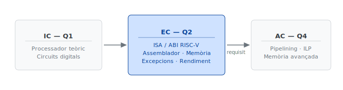

# Introducció {#sec-introduccio}

## Context

### L'eix d'arquitectura de computadors en el pla d'estudis FIB-GEI {#sec-context-eix-arquitectura}

L'assignatura d'Estructura de computadors (EC), de la qual soc coordinador des del segon quadrimestre (Q2) del curs 2024-25, és una assignatura del segon quadrimestre de la fase inicial (FI) del Grau en enginyeria informàtica (GEI) de la Facultat d'informàtica de Barcelona (FIB) de la Universitat Politècnica de Catalunya (UPC). Pel que fa a l'itinerari de l'estudiantat, tot i que el pla d'estudis del GEI no estableix requisits per a les assignatures de la FI, un gruix significatiu de continguts d'EC tenen els fonaments en continguts de l'assignatura de primer quadrimestre Introducció als computadors (IC). Superada la fase inicial, EC és requisit d'Interfícies de Computadors (CI) i Sistemes operatius (SO), totes dues de tercer quadrimestre, i Arquitectura de computadors (AC), de quart quadrimestre.

Arquitectònicament, a IC els estudiants, sense necessitat de cap coneixement previ de circuits digitals, arriben a comprendre en detall el disseny d'un computador (teòric) senzill format per un processador que consta d'unes 3.000 portes lògiques i uns 100 biestables, una memòria principal i un subsistema d'entrada/sortida amb un teclat i una impressora. S'estudien les bases dels circuits digitals combinacionals i seqüencials, es construeixen processadors formats per una unitat de procés i una unitat de control ambdues específiques per a la resolució d'un sol problema i s'arriba al processador de l'ordinador fent generals la unitat de procés i la de control, creant un llenguatge màquina de 25 instruccions que serveix per a executar qualsevol programa que poguéssim escriure en un llenguatge d'alt nivell.

A EC, partint de la base del disseny de computadors senzills après a IC, els estudiants fan el salt cap a l'estudi d'un microprocessador real i d'ús industrial. L'assignatura aprofundeix en l'arquitectura del computador analitzant els conceptes fonamentals d'ISA (*Instruction Set Architecture*) i ABI (*Application Binary Interface*), entenent com es defineix la frontera entre el programari i el maquinari. Al llarg del curs, s'estudia en detall el funcionament d'un subconjunt representatiu del repertori d'instruccions de RISC-V; aquest repertori és reduït precisament per simplificar el disseny del maquinari i permetre que cada instrucció s'executi de manera més ràpida i eficient. Aquest coneixement es posa en pràctica mitjançant la traducció de programes curts i fragments de codi de llenguatge C a llenguatge d'assemblador, de manera que l'estudiant comprèn com les estructures d'alt nivell es converteixen en instruccions reals. A més, s'introdueix la jerarquia de memòria amb l'estudi de la memòria cau, analitzant com la localitat de referència millora el rendiment global del sistema. Finalment, s'aborda la robustesa del sistema mitjançant la gestió d'excepcions i interrupcions, aprenent com el processador reacciona davant d'esdeveniments inesperats o peticions del sistema operatiu per garantir una execució controlada i segura.

A AC, un cop dominada l'estructura bàsica i el repertori d'instruccions a EC, els estudiants s'endinsen en el disseny de computadors d'alt rendiment mitjançant l'estudi de la segmentació (*pipelining*). Prenent com a referència l'arquitectura x86, s'analitza com dividir l'execució de les instruccions en etapes per augmentar el paral·lelisme a nivell d'instrucció (ILP), identificant i resolent els riscos o *hazards* estructurals, de dades i de control que sorgeixen en el flux de dades. Aquesta anàlisi es complementa amb l'estudi de la jerarquia de memòria avançada, on s'aprofundeix en el disseny i l'impacte de les memòries cau en el rendiment del sistema, així com en la gestió de la memòria virtual per garantir la protecció i l'eficiència en l'accés a les dades.

Així doncs, l'itinerari formatiu compost per IC, EC i AC, totes elles impartides pel Departament d'arquitectura de computadors (DAC), constitueix el tronc central de l'eix d'arquitectura del GEI de la FIB (@fig-eix-arquitectura). Aquesta seqüència representa l'itinerari tradicional i consolidat en els plans d'estudis d'informàtica a nivell internacional, ja que permet una evolució pedagògica natural: després de comprendre la lògica digital amb un processador teòric a IC, el pas per EC utilitzant una arquitectura RISC (*Reduced Instruction Set Computer*) és fonamental; el seu joc d'instruccions reduït i altament regular actua com el pas intermedi ideal, permetent a l'estudiant dominar els conceptes d'execució i traducció sense la complexitat del maquinari real. Finalment, a AC es culmina l'aprenentatge amb el model CISC (*Complex Instruction Set Computer*), on s'estudien arquitectures com x86 que, tot i la seva riquesa i heterogeneïtat d'instruccions, s'aborden amb èxit gràcies a la base sòlida adquirida prèviament.

{#fig-eix-arquitectura width="60%"}

### L'assignatura Estructura de computadors (EC)

#### Objectiu general

L'estudiant ha de ser capaç de comprendre i analitzar la frontera entre el programari i el maquinari (*Hardware/Software Interface*), dominant el funcionament intern d'un processador industrial basat en l'arquitectura RISC-V i els mecanismes que regeixen el rendiment i la robustesa del sistema.

#### Resultats d'aprenentatge específics

Per garantir un aprenentatge profund, els resultats d'aprenentatge específics (RA) s'estructuren segons la taxonomia de Bloom en la seva versió revisada (Anderson & Krathwohl, 2001; Bloom et al., 1956), progressant des dels nivells de recordar i comprendre fins als d'analitzar i avaluar:

**RA1. Anàlisi del rendiment i l'arquitectura**
:    - Identificar els diferents nivells d'abstracció d'un computador i la seva descripció jeràrquica.
:    - Avaluar el rendiment i el consum de potència d'un sistema computacional aplicant mesures estàndard i la Llei d'Amdahl per determinar l'impacte de les millores en el maquinari.

**RA2. Domini de la frontera Programari-Maquinari (ISA/ABI)**
:    - Relacionar la representació de dades bàsiques (naturals, enters i caràcters) i complexes (punters, vectors, matrius i cadenes de caràcters) amb la seva implementació física en memòria.
:    - Traduir fragments de codi de llenguatge d'alt nivell (C) a llenguatge d'assemblador RISC-V, fent ús correcte de les estructures de control, les subrutines i les convencions de l'ABI.

**RA3. Aritmètica del computador**
:    - Explicar el funcionament dels algorismes de l'aritmètica d'enters (suma, resta, multiplicació i divisió) i la representació en coma flotant sota l'estàndard IEEE 754.

**RA4. Optimització de la jerarquia de memòria**
:    - Analitzar el comportament de la memòria cau i la memòria virtual per optimitzar el rendiment del sistema basant-se en els principis de localitat espacial i temporal.
:    - Dissenyar esquemes bàsics de mapatge i associativitat, i calcular mètriques de fallada de memòria per avaluar-ne l'eficiència.

**RA5. Robustesa i gestió d'esdeveniments**
:    - Comprendre el suport del maquinari per a la gestió d'excepcions i interrupcions, identificant com el processador reacciona davant de fallades de sistema (com les de la TLB) o crides al sistema operatiu (*syscalls*).

#### Seqüenciació temàtica i programació temporal

L'estructura actual és el resultat d'una revisió pedagògica realitzada durant la migració. Respecte a l'assignatura original (basada en MIPS), s'han pres dues decisions estructurals rellevants:

- El Tema 1 original, que agrupava la introducció conceptual i els continguts de rendiment i potència, temes força inconnexos, s'ha dividit en dos temes independents: el nou T1 manté la introducció al computador i la codificació de dades, mentre que el nou T6 recull els continguts de rendiment i potència, com avantsala del tema dedicat a la millora del rendiment d'una de les parts funcionals bàsiques dels microprocessadors, la memòria cau (T7).
- L'aritmètica entera —que en l'estructura original formava part del T5 juntament amb la coma flotant i se'n feia un tractament indirecte de les instruccions— s'ha reallotjat al T4, i el T5 nou queda dedicat exclusivament a la coma flotant. Aquesta separació redueix la càrrega cognitiva de cada tema i clarifica la frontera conceptual entre els dos tipus d'aritmètica.

La @tbl-sequenciacio-tematica mostra la seqüenciació temàtica i temporal per a un quadrimestre de 13 setmanes.

| Set. | Tema | Contingut |
| :---: | :--- | :--- |
| 1 | 1 Introducció | Descripció jeràrquica del computador   Codificació de naturals i enters |
| 2 | 2 Instruccions i tipus de dades bàsics | Introducció a la ISA de RISC-V.   Formats d'instrucció.   Variables, memòria, operands, punters, vectors i cadenes. | 2--3 |
| 3 | 3 Traducció de programes | Operacions lògiques i desplaçaments.   Sentències *if* i bucles.   Subrutines.   Compilació, assemblatge, enllaçat i càrrega. | 4--5 |
| 4 | 4 Aritmètica entera i matrius | Suma, resta, multiplicació i divisió d'enters.   Sobreeiximent.   Matrius.   Optimitzacions de bucle. | 6 |
| 5 | 5 Coma flotant | Representació IEEE 754.   Operacions en coma flotant.   Coma flotant a RISC-V. | 7--8 |
| 6 | 6 Rendiment i potència | Mesures de rendiment.   Llei d'Amdahl.   Potència i escalat de Dennard. | 9 |
| 7 | 7 Memòria cau | Jerarquia de memòria.   Polítiques d'emplaçament, reemplaçament i escriptura.   Rendiment.   Tipologia de fallades.   Memòries cau multinivell | 10--11 |
| 8 | 8 Memòria virtual | Paginació.   Taula de pàgines.   Fallada de pàgina.   TLB. | 12 |
| 9 | 9 Excepcions i interrupcions. | Registres CSR.   Flux maquinari en detectar una excepció.   Rutina de servei.   Crides al sistema.   Interrupcions.   Fallada de TLB. | 13 |
: Seqüenciació temàtica i temporal per a un quadrimestre de 13 setmanes {#tbl-sequenciacio-tematica tbl-colwidths="[5,35,55,5]" .striped}

#### Relació entre resultats d'aprenentatge i seqüenciació temàtica

**Temes 1 i 6**: Alimenten el RA1 (Rendiment i arquitectura).

**Temes 2, 3, 4 i 5**: Construeixen el RA2 (Assemblador i traducció) i el RA3 (Aritmètica).

**Temes 7 i 8**: Construeixen el RA4 (Jerarquia de memòria).

**Tema 9**: Finalitza amb el RA5 (Excepcions i interrupcions).

#### Metodologia docent

Les classes de teoria combinen la part magistral, on el professor exposa, explica i exemplifica els conceptes objectiu de l'assignatura, amb la discussió amb l'alumnat sobre les alternatives i avantatges/inconvenients dels aspectes que convé debatre.

Les classes de problemes es realitzen de tres maneres: resolució directa del professor amb comentaris dels alumnes; resolució individual per part dels alumnes; i resolució cooperativa. En els dos darrers casos, el professor proporciona la retroalimentació necessària per corregir les parts incorrectes.

Les classes de laboratori segueixen una dinàmica similar a la de problemes, però la resolució d'exercicis es fa únicament en parelles i utilitzant eines que permeten la verificació semiautomàtica de les solucions. Els exercicis del laboratori s'avaluen de manera continuada per estimular el treball regular.

#### Materials docents

- Apunts de teoria
- Problemes i solucionaris
- Quadern de pràctiques de laboratori
- Compendi de referència RISC-V
- Webs: Guia docent (FIB), El Racó (campus virtual, FIB) i web de l'assignatura (DAC).

Els materials, originalment en format PDF sense fonts editables, han estat migrats íntegrament a format Quarto Markdown (`.qmd`) i es troben disponibles en un repositori de GitLab de la UPC, amb sortida en HTML i PDF des d'un únic punt d'entrada.

#### Avaluació

Nota numèrica: 0,20·max{EP,EF} + 0,60·EF + 0,20·(0,85·EL + 0,15·AC)

- EP: nota de l'examen parcial
- EF: nota de l'examen final
- EL: nota de l'examen de laboratori
- AC: nota de l'avaluació continuada de laboratori

Reavaluació: sí, cada quadrimestre.

## Descripció de les necessitats, oportunitats o problemàtiques detectades

### Necessitat: conveniència de l'actualització de l'arquitectura de referència

L'arquitectura MIPS va revolucionar la computació en introduir el concepte de *pipeline* sense bloquejos, una innovació radical que delegava la gestió dels conflictes de dades al compilador en lloc del maquinari. Aquesta simplicitat es traduïa en un cicle d'instrucció únic, instruccions de longitud fixa de 32 bits i una estricta estructura *Load/Store*. En conjunt, MIPS va demostrar que un maquinari simplificat, en mans d'un programari intel·ligent, era la clau per a la potència computacional moderna.

RISC-V és un projecte d'ISA obert i lliure d'ús, sorgit de la Universitat de Califòrnia, Berkeley. Va ser ideat per alguns dels mateixos enginyers que van ser pioners en l'arquitectura MIPS, i es beneficia de més de quaranta anys d'experiència en el disseny d'arquitectures RISC. La naturalesa oberta de RISC-V, amb una llicència permissiva, el distingeix d'altres arquitectures propietàries: qualsevol empresa o individu pot dissenyar, fabricar i vendre xips sense pagar drets de llicència. Un aspecte crucial de la seva importància actual és que RISC-V ha estat adoptada com a arquitectura de referència estratègica per diverses institucions i governs, incloent-hi la Unió Europea, que la veu com una eina clau per impulsar la sobirania tecnològica.

Així doncs, la migració de MIPS a RISC-V a EC no és només una actualització de continguts, sinó una decisió estratègica que alinea la formació dels futurs enginyers informàtics amb les tendències actuals i futures de la indústria i l'acadèmia.

### Oportunitat 1: migració de l'arquitectura de referència

Tècnicament, RISC-V presenta avantatges significatius sobre MIPS que el fan més adequat per a l'ensenyament. En primer lloc, RISC-V és una ISA oberta i lliure de drets d'ús, cosa que fomenta un ecosistema ric i accessible d'eines de desenvolupament, simuladors i implementacions en maquinari. Els estudiants poden descarregar i modificar lliurement compiladors i simuladors, o fins i tot dissenyar els seus propis processadors RISC-V sense les barreres legals o de cost associades a les arquitectures propietàries.

Un altre punt clau és la modularitat i simplicitat del disseny de RISC-V. L'ISA base (RV32I) conté menys de 50 instruccions, la qual cosa facilita enormement la comprensió inicial dels conceptes fonamentals del disseny de processadors. A partir d'aquesta base, es poden afegir extensions estàndard de manera modular (multiplicació i divisió, coma flotant, operacions atòmiques, etc.). Aquest enfocament «a la carta» permet al professorat estructurar el curs de manera progressiva, introduint complexitat a mesura que els estudiants assimilen els conceptes bàsics.

Finalment, RISC-V ha estat dissenyat des de zero tenint en compte les necessitats de la investigació i la docència modernes. Evita certes decisions de disseny heretades de MIPS que generaven confusió als estudiants. L'eliminació d'aquestes complexitats permet centrar el temps de classe en conceptes fonamentals i actuals.

### Oportunitat 2: revisió i harmonització dels continguts

S'aprofita l'actualització de la ISA per dur a terme una revisió exhaustiva de tot el material docent. L'objectiu principal és no només adaptar els exemples i la sintaxi al nou ISA, sinó també harmonitzar i millorar la qualitat general dels recursos. Aquesta revisió inclou els apunts de teoria, les llistes de problemes, els solucionaris, el quadern de laboratori i un nou compendi de referència RISC-V que substitueix completament l'anterior compendi MIPS.

Una decisió transversal d'aquesta revisió ha estat la redacció de tots els materials en **català normatiu**, amb un ús rigorós i consistent de la terminologia tècnica. La manca de recursos de referència en català per a l'arquitectura RISC-V va fer necessari elaborar un recull terminològic propi, documentat a `contrib.qmd`, que estableix els equivalents catalans dels termes tècnics més habituals del camp. Aquest recull, fruit de les decisions preses durant la migració i validat per l'equip docent durant la Revisió Externa, té valor per a la comunitat docent més enllà d'EC: qualsevol assignatura del mateix àmbit pot adoptar-lo com a referència o punt de partida.

### Oportunitat 3: format obert, accessibilitat i processament automatitzat

Separar els continguts de les metadades de presentació i estructurar-los jeràrquicament i de manera sistemàtica els fa molt més accessibles tant a les persones com a les màquines. S'aprofita l'actualització per dissociar i curar els continguts, que és on resideix realment el valor.

L'ús sistemàtic d'un llenguatge de marcatge jeràrquic com **Markdown** té, comparat amb el format PDF actual dels materials, dos avantatges clau: l'**accessibilitat universal** (les tecnologies assistives com els lectors de pantalla poden navegar el contingut de manera fluida) i la **integració de la IA** (els models de llenguatge interpreten amb més precisió els documents ben estructurats, cosa que facilita la generació de resums, exercicis personalitzats i anàlisi de dades d'aprenentatge).

**Quarto** és la plataforma de publicació científica i tècnica de codi obert triada per a aquest projecte. Un únic fitxer `.qmd` es pot renderitzar a múltiples formats d'alta qualitat (HTML, PDF, Word) i el sistema compleix els criteris d'accessibilitat de l'estàndard WCAG 2.1 del W3C. La integració amb **GitLab** permet el control de versions i la col·laboració asíncrona entre el professorat, i garanteix que tots els materials estiguin sempre harmonitzats.

### Oportunitat 4: enfortiment de la cohesió de l'equip docent

L'equip docent d'EC és divers tant pel que fa a anys d'experiència docent com pels grups de recerca i les àrees d'interès. Actualment està format per 10 professors, 2 dels quals a temps parcial i 4 professors lectors, dos d'ells incorporats el curs 2025-26.

La diversitat en la trajectòria docent ofereix un espai de transferència de bones pràctiques i d'alineació pedagògica. Els professors novells poden adquirir estratègies i recursos dels docents sènior, mentre que aquests darrers tenen l'oportunitat d'aprendre a aprofitar noves eines (com les basades en IA) i mètodes pedagògics innovadors. La metodologia de treball en grup, que combina sessions de videotrucada puntuals i treball asíncron a través del repositori compartit, enforteix la cohesió de l'equip i potencia la cultura de col·laboració.

## Motivació personal i justificació de la temàtica escollida

Des de la perspectiva del professor, la migració a RISC-V obre l'accés a un ecosistema de **recursos educatius moderns**. L'ecosistema RISC-V ha crescut exponencialment, amb simuladors avançats (com RARS), plaques de desenvolupament assequibles —com la Raspberry Pi Pico 2 W, amb nucli RP2350 RISC-V, que obre la porta a pràctiques amb maquinari real— i les darreres edicions dels llibres de referència de Patterson i Hennessy, que utilitzen RISC-V com a arquitectura principal.

A més, la naturalesa oberta de l'arquitectura obre la porta a **projectes de recerca i innovació** molt més rellevants. Permet als estudiants i investigadors experimentar amb noves idees en disseny de processadors, seguretat, compiladors o sistemes operatius sense les restriccions d'un ISA propietari.

## Relació amb la pràctica docent i el context institucional

La migració té implicacions directes tant en la praxi docent diària com en el posicionament estratègic de la institució. Des del punt de vista de la pràctica docent, s'abandonen eines de simulació com MARS o SPIM —estancades en el seu desenvolupament— per adoptar simuladors moderns com RARS, en desenvolupament actiu per part d'una comunitat global. Més enllà del programari, el canvi obre la porta a pràctiques de laboratori amb maquinari real: l'ecosistema RISC-V ofereix plaques de baix cost (com la Raspberry Pi Pico 2 W, amb nucli RP2350 RISC-V) que permeten als estudiants compilar codi assemblador i executar-lo en un dispositiu físic.

En el pla institucional, adoptar RISC-V és una decisió estratègica que transcendeix una sola assignatura. Posiciona el programa acadèmic a l'avantguarda, alineant-lo amb les iniciatives de sobirania tecnològica promogudes per governs i consorcis internacionals (com l'*European Processor Initiative*). A més, l'adopció d'una plataforma oberta fomenta un ecosistema d'innovació dins de la mateixa universitat i facilita projectes de final de grau, màsters i tesis doctorals sense les barreres de la propietat intel·lectual.

## Marc teòric i conceptual: referències actuals i rellevants {#sec-marc-teoric}

El marc teòric principal per a la docència de RISC-V es troba en els llibres de text que han establert l'estàndard de facto en l'ensenyament de l'arquitectura de computadors durant dècades. Les edicions més recents d'aquestes obres han adoptat RISC-V com a eix central, la qual cosa representa l'aval acadèmic més significatiu per a la migració.

Patterson i Hennessy (2021) presenten en la segona edició de *Computer Organization and Design RISC-V Edition* l'obra de referència fonamental per a qualsevol curs introductori d'estructura o arquitectura de computadors. El fet que els seus autors, pioners de MIPS, hagin reescrit completament el llibre al voltant de RISC-V és la declaració més clara del canvi de paradigma. En la mateixa línia, Hennessy i Patterson (2022) consoliden en la sisena edició de *Computer Architecture: A Quantitative Approach* RISC-V com a arquitectura vàlida per a la computació d'altes prestacions.

A nivell d'especificació tècnica, Waterman i Asanović (eds., 2019) mantenen *The RISC-V Instruction Set Manual* com el document fundacional que defineix amb precisió l'ISA base i les extensions estàndard. RISC-V International publica a més un conjunt d'especificacions ratificades que cobreixen l'arquitectura privilegiada, la gestió d'interrupcions i la depuració, essencials per a projectes avançats.

A nivell pràctic, Patterson i Waterman (2017) ofereixen en *The RISC-V Reader* una guia concisa de 180 pàgines que sintetitza conceptes arquitectònics complexos en un manual directe, amb 75 «punts clau de disseny» que expliquen la lògica de RISC-V en contrast amb arquitectures anteriors. Winans (2022) completa el panorama amb *RISC-V assembly language programming*, una introducció de codi obert per a principiants allotjada a GitHub, que prioritza la configuració d'entorns reals i l'aplicació pràctica.

## Revisió d'experiències o pràctiques similars {#sec-revisio-experiencies}

La transició de MIPS a RISC-V en l'àmbit acadèmic ha estat liderada per les mateixes institucions que van originar ambdues arquitectures. La Universitat de Califòrnia, Berkeley, bressol de RISC-V, ha estat la pionera: el seu curs CS 61C (*Great Ideas in Computer Architecture*) ha abandonat completament MIPS per adoptar RISC-V. El fet que Patterson i Hennessy hagin publicat les noves edicions del seu llibre canònic exclusivament amb RISC-V és el principal motor del canvi a escala global.

En l'escena internacional, la Universitat Cornell ha migrat la seva assignatura CS 3410 (*Computer System Organization and Programming*) a RISC-V de 64 bits, contribuint activament a l'ecosistema amb el seu propi intèrpret en línia i fent ús de simuladors visuals i interactius com Venus. A Europa, centres com l'ETH Zürich mostren un compromís profund amb RISC-V, especialment en recerca i cursos avançats on els estudiants aprenen a estendre l'ISA base amb instruccions personalitzades.

## Connexió amb el context del sistema educatiu català

A Catalunya, la transició està en marxa i és objecte de debat i planificació activa. La FIB-UPC, un referent en enginyeria informàtica, ha formalitzat propostes d'innovació docent per executar aquesta mateixa migració en assignatures com EC. Les propostes justifiquen el canvi per l'obsolescència industrial de MIPS i l'alineament estratègic amb RISC-V, considerant-lo clau per a la sobirania tecnològica i per dotar els estudiants de competències rellevants. L'experiència a la UPC se centra a substituir els simuladors clàssics de MIPS per eines modernes com RARS, que manté una interfície familiar però adaptada al nou ISA. Aquesta adopció progressiva, impulsada per la creació de la Xarxa-RISC-V a nivell de recerca dins de la mateixa universitat, assegura una transició coherent que s'estén des de la docència bàsica fins a la investigació de frontera.

## Definició de l'objectiu general i dels objectius específics del treball

L'**Objectiu general** d'aquest treball és l'actualització integral dels materials docents escrits de l'assignatura Estructura de Computadors (EC) del GEI a la FIB, substituint l'arquitectura MIPS per RISC-V com a nou referent d'aprenentatge.

Per assolir aquest objectiu general, es defineixen els objectius específics (OE) següents:

**OE1. Transició de l'arquitectura de referència (ISA)**
:   Migrar el corpus teòric i pràctic de l'assignatura (apunts, problemes i laboratoris) de l'arquitectura MIPS a RISC-V, assegurant la correcta aplicació de l'especificació de l'ISA i de l'ABI, i incorporant continguts nous sense equivalent en el material MIPS original.

 

**OE2. Transformació digital i accessibilitat**
:   Implementar un canvi de paradigma en el format dels materials, passant de formats tancats (PDF) a formats oberts i lleugers que facilitin el control de versions, garantint l'accessibilitat WCAG 2.1 i habilitant la navegació no lineal entre teoria, problemes i laboratoris, i facilitant la interacció amb eines d'aprenentatge basades en LLM.

 

**OE3. Harmonització, esmenes i sistema de qualitat**
:   Realitzar una revisió crítica de tots els continguts per unificar el lèxic tècnic, corregir inconsistències acumulades i alinear el discurs docent amb els estàndards actuals de la indústria i la recerca, tot aprofitant l'expertesa dels professors de l'assignatura vinculats al Barcelona Supercomputing Center (BSC), i establir un sistema de qualitat documentat (`contrib.qmd`, `sigles.qmd`, DoD-UP/CC/UR) que faci el corpus auditable i replicable.
