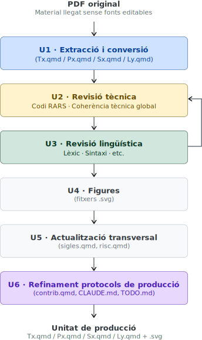

# Metodologia {#sec-metodologia}

## Enfocament metodològic i estratègies utilitzades {#sec-enfocament-metodologic}

El projecte s'estructura en dues etapes seqüencials amb objectius i actors diferenciats. L'**Etapa de producció** comprèn les fases de disseny, producció, integració, revisió de conjunt i revisió externa; té com a entrada el corpus de materials MIPS (teoria, problemaris, solucionaris i laboratoris) i com a producte el corpus RISC-V en la seva versió inicial (v0). L'**Etapa d'explotació**, de naturalesa iterativa per quadrimestres, pren el corpus v0 com a punt de partida i el consolida progressivament a través de cicles de preparació docent i revisió; a cada iteració, el *feedback* de l'aula retroalimenta la fase de revisió externa i n'incrementa la versió (v1, v2, …). Aquesta divisió permet tancar formalment el cicle de producció abans del primer desplegament i garanteix que la millora contínua s'incorpora de manera sistemàtica un cop els materials estan en ús.

### Etapa de producció {#sec-etapa-produccio}

L'execució del projecte s'ha basat en un enfocament de gestió àgil de projectes (*agile*), adaptant elements del marc Scrum (Schwaber & Sutherland, 2020) a la creació de continguts educatius. Aquesta tria respon a la necessitat de gestionar una migració complexa de materials llegats (*legacy*) en un entorn de col·laboració docent on el temps disponible és fragmentat i variable.

L'estratègia central ha estat la **migració iterativa i incremental**: en lloc d'abordar la totalitat del temari com un bloc monolític, s'ha treballat per unitats temàtiques funcionals, cadascuna seguint un cicle de producció que integra la IA generativa com a eina d'acceleració.

La decisió d'adoptar eines d'IA generativa va ser determinant per a l'assoliment dels resultats. Inicialment es va explorar NotebookLM —disponible al Google Workspace de la UPC— per a l'extracció de continguts dels PDF originals, la qual cosa va permetre validar la viabilitat de l'enfocament. Tot i que la seva orientació cap a la consulta de documents el feien útil per a una primera aproximació, el punt d'inflexió real del projecte va arribar amb l'adopció de Claude com a eina principal. La capacitat de mantenir el context complet del projecte —convencions d'estil, decisions prèvies, estructura dels materials— en una sola sessió de treball va eliminar la fragmentació i va permetre una producció de molt més alta qualitat. La velocitat de producció va augmentar de manera espectacular i la cobertura va superar amb escreix les previsions inicials. El pla inicial preveia acabar únicament la teoria per al lliurament final; finalment s'ha generat tot el material docent, s'ha formatat, s'ha fet una primera Revisió de Conjunt, i ja s'ha començat a fer la Revisió Externa, amb la revisió dels T2 i T3, que són el pinyol de l'assignatura, molt avançada.

Un segon factor d'acceleració va ser l'efecte d'aprenentatge acumulat al llarg del projecte: a mesura que avançava la migració, el coneixement sobre les convencions, les decisions de contingut i les particularitats de cada tema s'anava consolidant al repositori (fitxers `contrib.qmd`, `CLAUDE.md`), de manera que cada tema nou s'abordava amb un context més ric i produïa resultats de millor qualitat en menys iteracions.

El procés s'ha estructurat en cinc fases seqüencials, cadascuna amb un objectiu i un grau d'implicació de l'equip docent diferenciats (@fig-etapa-produccio). El plantejament de partida va ser que el professor responsable de la migració assumís íntegrament les fases individuals —P1 (Disseny del sistema de producció), P2 (Unitats de producció) i P3 (Integració)— de manera que la resta de l'equip docent pogués concentrar el seu temps en les fases col·legiades P3 i P4, on l'aportació disciplinar és més valuosa. Aquesta divisió del treball ha permès prendre les decisions de contingut i format de manera orgànica i coherent, i ha estat la condició que ha fet possible assolir el 100% del material en els terminis previstos. Les fases P3 i P4 han tingut com a objectiu consolidar la qualitat del corpus abans del desplegament: la Revisió de Conjunt (P3) per detectar i corregir errors i incoherències de manera individual, i la Revisió Externa (P4) per validar els continguts col·legiadament amb tot l'equip docent. La fletxa puntejada de la dreta indica que les decisions de convencions i entorn es milloren de manera contínua al llarg de totes les fases, retroalimentant P1.

{#fig-etapa-produccio width="55%"}

El concepte de *Definition of Done* (DoD) prové del marc Scrum (Schwaber & Sutherland, 2020) i ha estat adoptat i sistematitzat en la gestió de fluxos de producció iteratius per Poppendieck i Poppendieck (2003). En el context d'aquest projecte s'ha definit una DoD específica per a cada fase que implica producció o validació de contingut. La @tbl-dods en resumeix l'estructura:

| DoD | Fase | Unitat de treball | Nom de la unitat  de treball | Naturalesa dels criteris |
| :--- | :--- | :--- | :--- | :--- |
| **UP** | Producció | Tema / Problemari / Solucionari / Sessió | Unitat de producció | Binaris individuals |
| **CC** | Revisió de Conjunt | Corpus sencer | - | Binaris globals |
| **UR** | Revisió Externa | Tema + Problemari + Solucionari / Sessió | Unitat de revisió (externa) | Binaris col·legiats |
: Estructura de les tres *Definitions of Done* del projecte. L'ortogonalitat entre les unitats de treball de cada fase —amb granularitats diferents— permet un escrutini adaptat a l'objectiu de cadascuna. {#tbl-dods tbl-colwidths="[10,10,25,25,25]" .striped}

#### Fase P1: Disseny del sistema de producció

Molta d'aquesta feina l'he fet en paral·lel a la fase P2, de manera orgànica al llarg del projecte.

##### Productes

- Establiment de l'eina d'IA generativa (NotebookLM, primer, i Claude, després).
- Definició de les convencions d'estil i format (a fitxer `contrib.qmd`).
- Definició de l'estructura i organització dels materials (a `_quarto.yml`).
- Definició del flux de treball i les fases de producció (Cicle de producció, Revisió de conjunt i Revisió externa).
- Entorn de producció: repositori de GitLab, estructura de fitxers, plantilla de fitxers `.qmd`, etc.

Durant la resta de fases, he fet revisió constant d'aquests productes per integrar-hi l'aprenentatge adquirit a mesura que avançava el projecte, seguint sistemàticament el procediment d'esmenar primer els protocols i plantilles, aplicar-los al cas d'ús que n'havia motivat el canvi i, finalment, actualitzar els documents ja produïts.

#### Fase P2: Unitats de producció

L'ordre d'execució ha estat:

1. Tota la teoria
2. Tots els problemes i solucionaris
3. Tots els laboratoris

##### Productes

- 9 fitxers `Tx.qmd`, essent `x` el número de tema.
- 9 fitxers `PE_Tx.qmd`.
- 9 fitxers `PS_Tx.qmd`.
- 6 fitxers `Ly.qmd`, essent `y` el número de sessió.

Cada fitxer `.qmd` constitueix una **unitat de producció** independent: s'aborda de manera seqüencial i, un cop tancada, no es torna a reobrir llevat de decisions de la Revisió de Conjunt. 

##### Cicle de producció unitària

Tal com mostra la figura @fig-unitat-produccio, el cicle de producció de cada unitat de producció està format per les fases següents, que s'executen de manera seqüencial:

**U1. Extracció i conversió assistida per IA**
:   Secció a secció, a partir del PDF original.
**U2. Revisió tècnica**
:   Verificació de la correcció de tot el codi assemblador RISC-V al simulador RARS i revisió de la coherència tècnica global del tema.
**U3. Revisió lingüística**
:   Harmonització del lèxic i l'estil segons les convencions de `contrib.qmd`. Les fases U2 i U3 s'alternen iterativament fins a satisfer la DoD-UP.
**U4. Figures**
:   Generació de les figures SVG en versió *light* i *dark*.
**U5. Actualització transversal**
:   Incorporació de les sigles noves al glossari (`sigles.qmd`) i actualització d'altres materials afectats (`riscv.qmd`).
**U6. Refinament dels protocols de producció**
:   Actualització de `contrib.qmd`, `CLAUDE.md` i `TODO.md` amb les decisions i aprenentatges del tema, per capitalitzar-los en les unitats següents.

{#fig-unitat-produccio width="45%"}

##### *Definition of Done* d'Unitat de Producció (DoD-UP) {.unnumbered}

Una unitat de producció de P2 es considera acabada quan compleix tots els criteris següents, agrupats en tres categories:

**Qualitat tècnica**

- Tot el codi assemblador RISC-V s'executa sense errors al simulador RARS.
- S'han eliminat totes les referències a l'arquitectura MIPS.
- Les figures SVG estan generades en versió *light* i *dark* i integrades correctament al `.qmd`.

**Qualitat editorial**

- El contingut textual és complet i correctament formatat en Quarto Markdown.
- El lèxic i l'estil estan harmonitzats segons les convencions de `contrib.qmd`.
- El glossari de sigles (`sigles.qmd`) ha estat actualitzat amb les sigles noves del tema.

**Integritat estructural**

- El document és funcional dins de l'estructura del repositori GitLab (renderitza correctament en HTML i PDF).

#### Fase P3: Revisió de conjunt

- Detecció i esmena, quan no s'hagi de fer col·legiadament, d'errors, d'incoherències i d'oportunitats de millora tant tècniques com lingüístiques i pedagògiques.
- Figures, enllaços, harmonització d'estil, etc.
- Documentació de les decisions que s'han de prendre col·legiadament.
- Revisió humana: mitjana.

##### *Definition of Done* de Corpus Complet (DoD-CC) {.unnumbered}

La DoD-CC s'aplica al corpus sencer (no tema per tema) i verifica la coherència global del conjunt:

- Tots els fitxers `.qmd` han superat la DoD-UP.
- No hi ha inconsistències terminològiques o d'estil *entre* fitxers (lèxic, nomenclatura de registres, convencions de format).
- Totes les figures SVG segueixen la mateixa paleta de colors i convencions visuals documentades a `contrib.qmd`.
- El glossari `sigles.qmd` cobreix totes les sigles que apareixen al corpus.
- Tots els enllaços interns i referències creuades entre fitxers són funcionals.
- Les decisions pendents de consens col·legiat estan documentades com a *issues* oberts a GitLab.

#### Fase P4: Cicle de revisió externa

- El meu rol com a coordinador de la revisió: facilitació de la creació dels grups de treball (GTs), assignació de temes als GT, recopilació i sistematització dels comentaris. Definició dels procediments d'esmena i de presa de decisions; GitLab: protocol per a *issues*, *merge requests*, etc.
- Revisors externs: 6, comptant-m'hi jo. Cada revisor s'encarregarà de revisar un o més temes, segons la seva experiència i disponibilitat. La revisió es fa de manera col·laborativa, amb sessions de videotrucada per discutir els comentaris i arribar a consensos quan sigui necessari.
- Revisió humana: alta.

##### *Definition of Done* d'Unitat de Revisió (DoD-UR) {.unnumbered}

La **unitat de revisió** de P4 és diferent de la unitat de producció de P2: per a cada tema `x`, la unitat de revisió és el conjunt `{Tx.qmd, PE_Tx.qmd, PS_Tx.qmd}`, que es revisa conjuntament per garantir la coherència entre teoria, problemes i solucionari. Cada sessió de laboratori `Lx.qmd` es revisa com a unitat independent. Aquesta ortogonalitat entre les unitats de producció i les unitats de revisió és una decisió de disseny deliberada: permet que la fase P2 avanci tema a tema amb independència, mentre que la fase P4 avalua la coherència del conjunt teoria-problemes-solucionari com una unitat indivisible.

Una unitat de revisió de P4 es considera aprovada quan:

- Ha estat revisada per almenys un membre de l'equip docent extern al professor responsable de la migració.
- El codi assemblador ha estat verificat per un segon revisor.
- Tots els *issues* de GitLab oberts durant la revisió han estat resolts o tancats com a decisió de consens documentada.
- No hi ha inconsistències terminològiques respecte a les unitats de revisió ja aprovades.
- El tema ha estat aprovat mitjançant *merge request* amb almenys una aprovació explícita a GitLab.

#### Fase P5: Preparació de la docència

- Revisió individual dels dos professors que faran la primera docència de l'assignatura al Q1 del curs 2026-27.
- Per a la meva docència al Q1 del curs 2026-27 generaré diapositives que estaran disponibles públicament.

### Etapa d'explotació {#sec-etapa-explotacio}

L'Etapa d'explotació és de naturalesa iterativa: s'executa per quadrimestres i té com a entrada el corpus RISC-V (v0) produït durant l'Etapa de producció (@fig-etapa-explotacio). Cada iteració consta de dues fases. La **Fase E1 (Disseny del sistema d'explotació)** estableix les convencions, l'entorn i el flux de treball per al quadrimestre en curs, actualitzant els fitxers de referència `contrib.qmd`, `CLAUDE.md` i `TODO.md`. La **Fase E2 (Preparació docent)** produeix els materials de suport a la docència: principalment les diapositives de classe (`Dx.qmd` i fitxers `.svg` associats), que no formen part del corpus v0 i es generen per primera vegada en la primera iteració d'explotació. El *feedback* recollit durant el quadrimestre —errors detectats, exercicis ambigus, propostes de millora— s'incorpora en una nova iteració de revisió externa i incrementa la versió del corpus (v1, v2, …). Aquesta arquitectura garanteix que els materials millorin de manera sistemàtica i traçable amb cada cicle d'ús real a l'aula.

{#fig-etapa-explotacio width="55%"}

## Descripció de la innovació docent dissenyada

La innovació dissenyada es vertebra en quatre eixos fonamentals:

### Innovació en el contingut (RISC-V)

L'adopció de RISC-V no és només un canvi d'arquitectura, sinó una aposta per un estàndard obert i modular. El nou programa se centra en la claredat pedagògica que ofereix aquesta ISA: elimina conceptes heretats de MIPS que generaven confusió (com els *branch delay slots* o els registres de multiplicació especials `HI`/`LO`) i introdueix la modularitat com a principi estructurador del curs, presentant primer la base RV32I i afegint progressivament les extensions M (multiplicació/divisió) i F (coma flotant).

### Innovació en el format (Quarto Markdown i GitLab)

La transició a Quarto Markdown permet que els materials siguin llegibles tant per humans com per màquines, seguint el paradigma *Docs-as-Code*. L'ús de GitLab com a repositori centralitzat facilita el control de versions i la sincronització entre el professorat. El resultat és un **punt d'entrada únic**: una URL que dona accés a tot el material en HTML (navegable, amb mode fosc/clar, *responsive* i accessible WCAG 2.1) i un únic fitxer PDF descarregable.

### Reestructuració pedagògica del temari

La migració ha estat l'ocasió per revisar críticament l'estructura temàtica de l'assignatura. La nova organització no és un mapatge 1:1 dels materials originals: s'han pres decisions pedagògiques explícites per millorar la progressió didàctica i la coherència interna.

Els canvis estructurals més rellevants són dos. En primer lloc, el Tema 1 original (Introducció) s'ha dividit en dos: el nou T1 manté la introducció conceptual a l'arquitectura de computadors i la codificació de dades, mentre que el nou T6 agrupa els continguts de rendiment i potència. Aquesta separació permet tractar el rendiment com un tema autònom, amb el context que l'estudiant ja ha adquirit en els temes anteriors sobre ISA i programació. En segon lloc, l'aritmètica entera —que en l'estructura original formava part del Tema 5 (Aritmètica d'enters i coma flotant)— s'ha reallotjat en el nou T4 (Aritmètica entera i matrius), mentre que el nou T5 queda dedicat exclusivament a la coma flotant. Aquesta reorganització clarifica la frontera entre aritmètica entera i en coma flotant, i redueix la càrrega cognitiva de cadascun dels temes.

Les taules @tbl-reestructuracio-teoria, @tbl-reestructuracio-laboratori, @tbl-reestructuracio-problemes, @tbl-reestructuracio-nou i @tbl-reestructuracio-transversals mostren la correspondència completa entre els materials originals (MIPS) i els nous (RISC-V), organitzades per categoria.

| Material RISC-V (nou) | Equivalent MIPS (original) | Observacions |
| :--- | :--- | :--- |
| **T1. Introducció** | | |
| T1.1. La gestió de la complexitat: Capes i interfícies | T1 §1. Descripció jeràrquica | Reorganitzat i ampliat |
| T1.2. El cicle de vida del programa | T1 §1. Descripció jeràrquica | Segregat com a secció independent |
| T1.3. El model de Von Neumann | T1 §1. Descripció jeràrquica | Segregat com a secció independent |
| T1.4. Codificació de naturals en base 2 | T2 §5. Repàs de naturals | Avançat a T1; integrat al flux conceptual |
| T1.5. Codificació d'enters en base 2 | T2 §6. Repàs d'enters | Avançat a T1; integrat al flux conceptual |
| **T2. Instruccions i tipus de dades bàsics** | | |
| T2.1. Introducció a l'ISA de RISC-V | T2 §1. Introducció a la MIPS ISA | Reescrit íntegrament per a RISC-V |
| T2.2. Format de les instruccions RV32I | T2 §8. Format de les instruccions MIPS | Reescrit íntegrament per a RISC-V |
| T2.3. Estructura d'un programa en assemblador | T2 §3. (implícit) | Formalitzat com a secció independent |
| T2.4. Variables escalars | T2 §3. Variables | Reorganitzat |
| T2.5. La memòria | T2 §2. La memòria | — |
| T2.6. Operands i modes d'adreçament | T2 §4. Operands | Ampliat amb modes d'adreçament |
| T2.7. Punters | T2 §11. Punters | — |
| T2.8. Vectors | T2 §9. Vectors | — |
| T2.9. Caràcters i cadenes de caràcters | T2 §10. Cadenes de caràcters | Ampliat amb caràcters |
| **T3. Traducció de programes** | | |
| T3.1. Desplaçaments de bits | T3 §1. Desplaçaments de bits | — |
| T3.2. Operacions lògiques bit a bit | T3 §2. Operacions lògiques bit a bit | — |
| T3.3. Comparacions i operacions booleanes | T3 §3. Comparacions i operacions booleanes | — |
| T3.4. Salts | T3 §4. Salts | Reescrit per a RISC-V (eliminat *branch delay slot*) |
| T3.5. Revisió dels modes d'adreçament | — | Nou: consolidació didàctica sense equivalent MIPS |
| T3.6. Sentències alternatives: if-then-else i switch | T3 §5. Sentències alternatives | — |
| T3.7. Sentències iteratives: while, for i do-while | T3 §6. Sentències iteratives | — |
| T3.8. Estructura de la memòria | T3 §8. Estructura de la memòria | — |
| T3.9. Subrutines | T3 §7. Subrutines | Reescrit per a ABI RISC-V |
| T3.10. Compilació, assemblatge, enllaçat i càrrega | T3 §9. Compilació, muntatge i càrrega | Ampliat amb GCC/Clang toolchain |
| **T4. Aritmètica entera i matrius** | | |
| T4.1. Suma, resta i canvi de signe | T5 §1. Overflow de suma i resta | Avançat de T5 a T4 |
| T4.2. Sobreeiximent en suma i resta d'enters | T5 §1. Overflow de suma i resta | Avançat de T5 a T4 |
| T4.3. Multiplicació entera | T5 §2. Multiplicació entera; T4 §1. mult/mflo/mfhi | Fusionat i reescrit per a RV32IM |
| T4.4. Matrius | T4 §2. Matrius | — |
| T4.5. Optimitzacions de bucle | T4 §3–4. Accés seqüencial i recorreguts | Ampliat i formalitzat |
| T4.6. Divisió entera | T5 §3. Divisió entera | Avançat de T5 a T4 |
| **T5. Coma flotant** | | |
| T5.1. Representació en coma flotant | T5 §4. Representació CF | — |
| T5.2. Operacions en coma flotant | T5 §5–6. Suma i multiplicació CF | — |
| T5.3. Coma flotant a RISC-V (RV32F) | T5 §7. La coma flotant en MIPS | Reescrit íntegrament per a RV32F |
| **T6. Rendiment i potència** | | |
| T6.1. Rendiment | T1 §2. Rendiment i potència | Segregat de T1 com a tema independent |
| T6.2. Llei d'Amdahl | T1 §3. Llei d'Amdahl | Segregat de T1 |
| T6.3. Potència | T1 §4. Mesures de dissipació | Segregat de T1; ampliat amb escalat de Dennard |
| **T7. Memòria cau** | | |
| T7.1. La jerarquia de memòria | T6 §1. Introducció | Ampliat amb context GPU i IA |
| T7.2. La memòria cau | T6 §2. Disseny bàsic | — |
| T7.3. Política d'emplaçament | T6 §3. Correspondència directa | Ampliat amb associativitat |
| T7.4. Política de reemplaçament | T6 §6. Associativitat | Reorganitzat |
| T7.5. Política d'escriptura | T6 §4. Polítiques d'escriptura | — |
| T7.6. Rendiment | T6 §5. Mesures de rendiment | — |
| T7.7. Tipologia de les fallades | T6 §8. Tipologia de les fallades | — |
| T7.8. Memòries cau multinivell | T6 §7. Caches multinivell | — |
| **T8. Memòria virtual** | | |
| T8.1. Introducció | T7 §1. Introducció | — |
| T8.2. Paginació | T7 §2. Funcionament de la MV | Reorganitzat i ampliat |
| T8.3. La taula de pàgines | T7 §2. Funcionament de la MV | Segregat; ampliat amb taules multinivell |
| T8.4. Fallada de pàgina | T7 §3. Fallada de pàgina | — |
| T8.5. Traducció ràpida: el TLB | T7 §4. Traducció ràpida amb TLB | Ampliat amb *TLB shootdown* multicore |
| **T9. Excepcions i interrupcions** | | |
| T9.1. Excepcions i interrupcions | T8 §1–4. Introducció, CP0, accions HW/SW | Reescrit íntegrament per a CSR RISC-V |
| T9.2. Crides al sistema | T8 §6. Crides al sistema | Reescrit per a `ecall` RISC-V |
| T9.3. Entrada/Sortida | T8 §7. Interrupcions | Ampliat |
: **Teoria**. La migració de la teoria ha requerit la reescriptura íntegra dels temes relacionats amb l'ISA (T2, T3, T4, T5 i T9), on la diferència entre MIPS i RISC-V és més profunda. Els temes de jerarquia de memòria (T7 i T8) han requerit menys reescriptura de base però s'han ampliat amb continguts nous rellevants per al context tecnològic actual (GPUs, sistemes multicore, taules de pàgines multinivell). {#tbl-reestructuracio-teoria}

| Sessió RISC-V (nova) | Equivalent MIPS (original) | Observacions |
| :--- | :--- | :--- |
| L1. Introducció al simulador RARS | S0. Introducció (MARS) | Eina substituïda: MARS → RARS |
| L2. Assemblador RISC-V i tipus bàsics | S1. Assemblador MIPS i tipus bàsics | Reescrit íntegrament per a RISC-V |
| L3. Traducció de programes | S2. Traducció de programes | Reescrit íntegrament per a RISC-V |
| L4. Matrius i subrutines | S3. Tipus de dades estructurats | Ampliat amb subrutines |
| L5. Coma flotant i compilació separada | S4. Codificació en coma flotant | Ampliat amb compilació separada |
| L6. Memòria cau | S5. Memòria cau | Reescrit; ampliat amb *loop tiling* |
: **Laboratori.** El canvi més visible al laboratori és la substitució de MARS per RARS com a simulador de referència. Pel que fa als continguts, la reorganització de la teoria ha comportat el canvi de sessió d'algunes parts de les pràctiques de MIPS, i s'ha aprofitat el fet de treballar amb dos arxius de C simultàniament a la sessió de coma flotant (L5) per tractar la compilació separada. {#tbl-reestructuracio-laboratori}

| Tema | Cobertura |
| :--- | :--- |
| T2 | *Little-endian*, ordre de bytes |
| T2 | Bucles sobre vectors (init, suma, còpia inversa) |
| T2 | Cerca en vector, retorn −1 |
| T2 | Aritmètica de punters sobre `short` |
| T2 | Funció `longitud` amb `'\0'` |
| T2 | Còpia de string |
| T3 | `switch` amb salts encadenats i *jump table* |
| T3 | Compilació separada, símbols externs, `auipc` |
| T4 | Optimització #2: condició al final |
| T4 | Optimització #3: eliminació variable d'inducció |
| T5 | `flw`/`fsw`, `flt.s` |
| T5 | `fcvt.w.s`, `fcvt.s.w`, truncament vs. arrodoniment |
| T6 | Amdahl bàsic, límit teòric |
| T6 | Amdahl amb tres components simultanis |
| T6 | Amdahl invers: quin % de CF cal per a speedup 10× |
| T7 | *Cold-start*, conflicte, capacitat amb seqüències concretes |
| T7 | Conflictes entre dos vectors, efecte de l'adreça base |
| T8 | Taula de pàgines de dos nivells, mida, avantatge |
| T8 | Bit de protecció W, excepcions de protecció |
| T8 | Integració TLB+cau, VIPT, condició antialiàsing |
| T9 | `mepc`, `mtvec` direct/vectored, ajust +4 per `ecall` |
| T9 | Fallada de TLB com a excepció, gestió RSE |
| T9 | Interrupcions E/S, `MIE`/`MEIE`, RSE de teclat |
: **Problemes i solucionaris.** Tot el banc de problemes ha estat reescrit per a RISC-V. A més, s'han afegit 23 exercicis nous llistats en aquesta taula que cobreixen continguts sense equivalent en el material MIPS original —principalment els derivats de la modularitat de RISC-V i dels canvis estructurals del temari. {#tbl-reestructuracio-problemes}

| Contingut nou | Ubicació | Justificació pedagògica |
| :--- | :--- | :--- |
| RISC-V GNU Compiler Toolchain | T2 | Eina estàndard de l'ecosistema; absència total a MIPS |
| Extensions M i F (modularitat) | T2 | Modularitat de RISC-V vs. integració de MIPS |
| GPUs i memòria en l'era de la IA | T7 | Context tecnològic actual; motivació per a l'estudi de la jerarquia de memòria |
| Taules de pàgines multinivell | T8 | Sistemes operatius moderns; prerequisit implícit per a SO |
| Modes de privilegi M/S/U | T9 | Arquitectura de privilegis RISC-V; absència conceptual a MIPS |
: **Contingut nou sense equivalent MIPS.** La modularitat de RISC-V —el disseny en extensions estàndard opcionals— ha permès introduir continguts que en una arquitectura monolítica com MIPS no tenien sentit pedagògic. La transició cap a un estàndard obert ha permès també incorporar continguts de sobirania tecnològica i context industrial actual que reforcen la motivació de l'estudiantat. {#tbl-reestructuracio-nou tbl-colwidths="[35,10,55]" .striped}

| Material | Descripció |
| :--- | :--- |
| `riscv.qmd` — Compendi de referència RISC-V | Taules de referència ràpida de l'ISA, l'ABI i les extensions; substitueix el compendi MIPS i l'amplifica |
| `sigles.qmd` — Glossari de sigles | Llistat unificat de totes les sigles de l'assignatura, actualitzat incrementalment durant la migració |
| `contrib.qmd` — Convencions i normes d'estil | Sistema de qualitat del projecte: format, lèxic, paleta SVG i decisions per tema; garanteix la coherència del corpus a llarg termini |
: **Materials transversals.** Un resultat destacat del projecte és la creació d'una infraestructura de qualitat que fa el corpus auditable i editable per qualsevol membre de l'equip docent, independentment de qui hagi produït cada part. Aquests tres materials no existien en cap forma en el material original. {#tbl-reestructuracio-transversals tbl-colwidths="[45,55]" .striped}

### Recursos d'aprenentatge actiu

- **Simulació avançada (RARS)**: Substitueix MARS com a entorn de referència, mantenint una interfície familiar però adaptada al nou ISA.
- **Maquinari real (Raspberry Pi Pico 2 W)**: Proposta de pràctica voluntària amb plaques RP2350 (nucli RISC-V) i *Debug Probes*. Permet als estudiants compilar codi assemblador i executar-lo en un dispositiu físic d'última generació.

## Recollida de dades: instruments i població d'estudi {#sec-recollida-dades}

Atès que el projecte es troba en la Fase de Revisió Externa (P4), la recollida de dades s'ha estructurat en dues fases temporals amb objectius diferenciats.

**Fase actual (P3–P4, fins al lliurament)**: La recollida se centra en la validació experta i el control de qualitat del procés, més que en l'avaluació directa de l'estudiantat.

**Població d'estudi**: El grup de treball està format pel professorat de l'assignatura d'EC i membres de l'eix d'arquitectura del Departament d'Arquitectura de Computadors (DAC), incloent-hi investigadors vinculats al Barcelona Supercomputing Center (BSC).

**Instruments de recollida (P3–P4)**:

- ***Definitions of Done* (DoD-UP, DoD-CC i DoD-UR)**: Sistema de criteris de tancament per fase (vegeu @sec-enfocament-metodologic). Actuen com a instrument de verificació formal en cada fase del procés.
- **Sessions de coordinació**: Videotrucades puntuals i treball asíncron a través del repositori GitLab, on les *pull requests* i els *commits* documenten les decisions de contingut.
- **Registres de traçabilitat (logs de IA)**: Documentació del procés de conversió assistida per IA per avaluar l'eficiència de l'eina i la necessitat de supervisió humana.

**Fase prospectiva (Implementació, Q1 2026-27)**: La primera validació amb estudiants reals tindrà lloc al primer quadrimestre del curs 2026-27, en 2 grups de teoria i 3 o 4 grups de laboratori. Els instruments previstos són:

- **Seguiment del rendiment acadèmic**: Comparativa de les taxes de superació als exàmens, amb focus en els temes que presenten històricament les dificultats més altes (T7 Memòria cau i T9 Excepcions i interrupcions), contrastant amb els resultats dels cursos anteriors amb materials MIPS.
- **Enquesta de satisfacció**: Qüestionari focalitzat en la claredat i la usabilitat dels materials en format web (navegació, accessibilitat, mode fosc/clar, funcionalitat del cercador integrat).
- **Registre d'incidències**: Recollida sistemàtica d'errors de codi no detectats a la validació prèvia i de formulacions d'exercicis ambigues, reportats pels professors durant les sessions de laboratori.

## Consideracions ètiques

Tot i que en aquesta fase el treball no inclou experimentació directa amb dades personals dels estudiants, s'han tingut en compte les dimensions ètiques següents:

1. **Ús responsable de la IA**: La utilització de la IA en l'elaboració dels materials s'ha regit pel principi de la supervisió humana crítica. S'ha vetllat per evitar l'acceptació d'«al·lucinacions» tècniques que poguessin perjudicar la qualitat de l'aprenentatge.
2. **Accessibilitat i sostenibilitat**: L'elecció del format Markdown respon a un compromís ètic amb l'accessibilitat digital i el manteniment futur per part de la comunitat docent.
3. **Transparència**: Els estudiants han estat informats de l'ús d'eines d'IA en la creació del material i han rebut pautes per a un ús ètic i pedagògic d'aquestes eines en el seu procés d'estudi.

