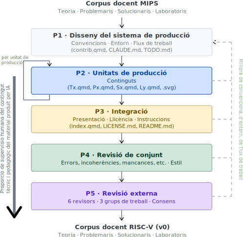

# Metodologia {#sec-metodologia}

## Enfocament metodològic i estratègies utilitzades {#sec-enfocament-metodologic}

El projecte s'estructura en dues etapes seqüencials amb objectius i actors diferenciats. L'**Etapa de producció** comprèn les fases de disseny, producció, integració, revisió de conjunt i revisió externa; té com a entrada el corpus de materials MIPS (teoria, problemaris, solucionaris i laboratoris) i com a producte el corpus RISC-V en la seva versió inicial (v0). L'**Etapa d'explotació**, de naturalesa iterativa per quadrimestres, pren el corpus v0 com a punt de partida i el consolida progressivament a través de cicles de preparació docent i revisió; a cada iteració, el *feedback* de l'aula retroalimenta la fase de revisió externa i n'incrementa la versió (v1, v2, …). Aquesta divisió permet tancar formalment el cicle de producció abans del primer desplegament i garanteix que la millora contínua s'incorpora de manera sistemàtica un cop els materials estan en ús.

### Etapa de producció {#sec-etapa-produccio}

L'execució del projecte s'ha basat en un enfocament de gestió àgil de projectes (*agile*), adaptant elements del marc Scrum (Schwaber & Sutherland, 2020) a la creació de continguts educatius. Aquesta tria respon a la necessitat de gestionar una migració complexa de materials llegats (*legacy*) en un entorn de col·laboració docent on el temps disponible és fragmentat i variable.

L'estratègia central ha estat la **migració iterativa i incremental**: en lloc d'abordar la totalitat del temari com un bloc monolític, s'ha treballat per unitats temàtiques funcionals, cadascuna seguint un cicle de producció que integra la IA generativa com a eina d'acceleració.

La decisió d'adoptar eines d'IA generativa va ser determinant per a l'assoliment dels resultats. Inicialment es va explorar NotebookLM (Google, 2024), disponible al Google Workspace de la UPC, per a l'extracció de continguts dels PDF originals, la qual cosa va permetre validar la viabilitat de l'enfocament. Tot i que la seva orientació cap a la consulta de documents el feien útil per a una primera aproximació, el punt d'inflexió real del projecte va arribar amb l'adopció de Claude (Claude 2025) com a eina principal. La capacitat de mantenir el context complet del projecte —convencions d'estil, decisions prèvies, estructura dels materials— en una sola sessió de treball va eliminar la fragmentació i va permetre una producció de molt més alta qualitat. La velocitat de producció va augmentar de manera espectacular i la cobertura va superar amb escreix les previsions inicials. El pla inicial preveia acabar únicament la teoria per al lliurament final; finalment s'ha generat tot el material docent, s'ha formatat, s'ha fet una primera Revisió de Conjunt, i ja s'ha començat a fer la Revisió Externa, amb la revisió dels T2 i T3, que són el pinyol de l'assignatura, molt avançada.

Un segon factor d'acceleració va ser l'efecte d'aprenentatge acumulat al llarg del projecte: a mesura que avançava la migració, el coneixement sobre les convencions, les decisions de contingut i les particularitats de cada tema s'anava consolidant al repositori (fitxers `contrib.qmd`, `CLAUDE.md`), de manera que cada tema nou s'abordava amb un context més ric i produïa resultats de millor qualitat en menys iteracions.

El procés s'ha estructurat en cinc fases seqüencials, cadascuna amb un objectiu i un grau d'implicació de l'equip docent diferenciats (@fig-etapa-produccio). El plantejament de partida va ser que el professor responsable de la migració assumís íntegrament les fases individuals —P1 (Disseny del sistema de producció), P2 (Unitats de producció) i P3 (Revisió de Conjunt)— de manera que la resta de l'equip docent pogués concentrar el seu temps en la fase col·legiada P4 (Cicle de Revisió Externa), on l'aportació disciplinar és més valuosa. Aquesta divisió del treball ha permès prendre les decisions de contingut i format de manera orgànica i coherent, i ha estat la condició que ha fet possible assolir el 100% del material en els terminis previstos. Les fases P3 i P4 han tingut com a objectiu consolidar la qualitat del corpus abans del desplegament: la Revisió de Conjunt (P3) per detectar i corregir errors i incoherències de manera individual, i el Cicle de Revisió Externa (P4) per validar els continguts col·legiadament amb tot l'equip docent.

{#fig-etapa-produccio width="55%"}

El concepte de *Definition of Done* (DoD) prové del marc Scrum (Schwaber & Sutherland, 2020) i ha estat adoptat i sistematitzat en la gestió de fluxos de producció iteratius per Poppendieck i Poppendieck (2003). En el context d'aquest projecte s'ha definit una DoD específica per a cada fase que implica producció o validació de contingut. La @tbl-dods en resumeix l'estructura:

| DoD | Fase | Unitat de treball | Nom de la unitat de treball | Naturalesa dels criteris |
| :--- | :--- | :--- | :--- | :--- |
| **UP** | Producció | Tema / Problemari / Solucionari / Sessió | Unitat de producció | Binaris individuals |
| **CC** | Revisió de Conjunt | Corpus sencer | - | Binaris globals |
| **UR** | Revisió Externa | Tema + Problemari + Solucionari / Sessió | Unitat de revisió (externa) | Binaris col·legiats |
: Estructura de les tres *Definitions of Done* del projecte. L'ortogonalitat entre les unitats de treball de cada fase —amb granularitats diferents— permet un escrutini adaptat a l'objectiu de cadascuna. {#tbl-dods tbl-colwidths="[5,11,25,29,25]" .striped}

#### Fase P1: Disseny del sistema de producció

Molta d'aquesta feina l'he fet en paral·lel a la fase P2, de manera orgànica al llarg del projecte.

##### Productes

- Establiment de l'eina d'IA generativa (NotebookLM, primer, i Claude, després).
- Definició de les convencions d'estil i format (a fitxer `contrib.qmd`).
- Definició de l'estructura i organització dels materials (a `_quarto.yml`).
- Definició del flux de treball i les fases de producció (Cicle de producció, Revisió de conjunt i Revisió externa).
- Entorn de producció: repositori de GitLab, estructura de fitxers, plantilla de fitxers `.qmd`, etc.

Durant la resta de fases, he fet revisió constant d'aquests productes per integrar-hi l'aprenentatge adquirit a mesura que avançava el projecte, seguint sistemàticament el procediment d'esmenar primer els protocols i plantilles, aplicar-los al cas d'ús que n'havia motivat el canvi i, finalment, actualitzar els documents ja produïts.

#### Fase P2: Unitats de producció

L'ordre d'execució ha estat:

1. Tota la teoria
2. Tots els problemes i solucionaris
3. Tots els laboratoris

##### Productes

- 9 fitxers `Tx.qmd`, essent `x` el número de tema.
- 9 fitxers `PE_Tx.qmd`.
- 9 fitxers `PS_Tx.qmd`.
- 6 fitxers `Ly.qmd`, essent `y` el número de sessió.

Cada fitxer `.qmd` constitueix una **unitat de producció** independent: s'aborda de manera seqüencial i, un cop tancada, no es torna a reobrir llevat de decisions de la Revisió de Conjunt. 

* **Grau de supervisió humana del contingut tècnic i pedagògic**: Bàsic.

##### Cicle de producció unitària

Tal com mostra la figura @fig-unitat-produccio, el cicle de producció de cada unitat de producció està format per les fases següents, que s'executen de manera seqüencial:

**U1. Extracció i conversió assistida per IA**
:   Secció a secció, a partir del PDF original.

**U2. Revisió tècnica**
:   Verificació de la correcció de tot el codi assemblador RISC-V al simulador RARS i revisió de la coherència tècnica global del tema.

**U3. Revisió lingüística**
:   Harmonització del lèxic i l'estil segons les convencions de `contrib.qmd`. Les fases U2 i U3 s'alternen iterativament fins a satisfer la DoD-UP.

**U4. Figures**
:   Generació de les figures SVG en versió *light* i *dark*.

**U5. Actualització transversal**
:   Incorporació de les sigles noves al glossari (`sigles.qmd`) i actualització d'altres materials afectats (`riscv.qmd`).

**U6. Refinament dels protocols de producció**
:   Actualització de `contrib.qmd`, `CLAUDE.md` i `TODO.md` amb les decisions i aprenentatges del tema, per capitalitzar-los en les unitats següents.

{#fig-unitat-produccio width="45%"}

##### *Definition of Done* d'Unitat de Producció (DoD-UP) {.unnumbered}

Una unitat de producció de P2 es considera acabada quan compleix tots els criteris següents, agrupats en tres categories:

**Qualitat tècnica**

- Tot el codi assemblador RISC-V s'executa sense errors al simulador RARS.
- S'han eliminat totes les referències a l'arquitectura MIPS.
- Les figures SVG estan generades en versió *light* i *dark* i integrades correctament al `.qmd`.

**Qualitat editorial**

- El contingut textual és complet i correctament formatat en Quarto Markdown.
- El lèxic i l'estil estan harmonitzats segons les convencions de `contrib.qmd`.
- El glossari de sigles (`sigles.qmd`) ha estat actualitzat amb les sigles noves del tema.

**Integritat estructural**

- El document és funcional dins de l'estructura del repositori GitLab (renderitza correctament en HTML i PDF).

#### Fase P3: Revisió de conjunt

- Detecció i esmena, quan no s'hagi de fer col·legiadament, d'errors, d'incoherències i d'oportunitats de millora tant tècniques com lingüístiques i pedagògiques.
- Figures, enllaços, harmonització d'estil, etc.
- Documentació de les decisions que s'han de prendre col·legiadament.
- **Grau de supervisió humana del contingut tècnic i pedagògic**: Moderat.

##### *Definition of Done* de Corpus Complet (DoD-CC) {.unnumbered}

La DoD-CC s'aplica al corpus sencer (no tema per tema) i verifica la coherència global del conjunt:

- Tots els fitxers `.qmd` han superat la DoD-UP.
- No hi ha inconsistències terminològiques o d'estil *entre* fitxers (lèxic, nomenclatura de registres, convencions de format).
- Totes les figures SVG segueixen la mateixa paleta de colors i convencions visuals documentades a `contrib.qmd`.
- El glossari `sigles.qmd` cobreix totes les sigles que apareixen al corpus.
- Tots els enllaços interns i referències creuades entre fitxers són funcionals.
- Les decisions pendents de consens col·legiat estan documentades com a *issues* oberts a GitLab.

#### Fase P4: Cicle de revisió externa

- El meu rol com a coordinador de la revisió: facilitació de la creació dels grups de treball (GTs), assignació de temes als GT, recopilació i sistematització dels comentaris. Definició dels procediments d'esmena i de presa de decisions; GitLab: protocol per a *issues*, *merge requests*, etc.
- Revisors externs: 6, comptant-m'hi jo. Cada revisor s'encarregarà de revisar un o més temes, segons la seva experiència i disponibilitat. La revisió es fa de manera col·laborativa, amb sessions de videotrucada per discutir els comentaris i arribar a consensos quan sigui necessari.
- **Grau de supervisió humana del contingut tècnic i pedagògic**: Alt.

##### *Definition of Done* d'Unitat de Revisió (DoD-UR) {.unnumbered}

La **unitat de revisió** de P4 és diferent de la unitat de producció de P2: per a cada tema `x`, la unitat de revisió és el conjunt `{Tx.qmd, PE_Tx.qmd, PS_Tx.qmd}`, que es revisa conjuntament per garantir la coherència entre teoria, problemes i solucionari. Cada sessió de laboratori `Lx.qmd` es revisa com a unitat independent. Aquesta ortogonalitat entre les unitats de producció i les unitats de revisió és una decisió de disseny deliberada: permet que la fase P2 avanci tema a tema amb independència, mentre que la fase P4 avalua la coherència del conjunt teoria-problemes-solucionari com una unitat indivisible.

Una unitat de revisió de P4 es considera aprovada quan:

- Ha estat revisada per almenys un membre de l'equip docent extern al professor responsable de la migració.
- El codi assemblador ha estat verificat per un segon revisor.
- Tots els *issues* de GitLab oberts durant la revisió han estat resolts o tancats com a decisió de consens documentada.
- No hi ha inconsistències terminològiques respecte a les unitats de revisió ja aprovades.
- El tema ha estat aprovat mitjançant *merge request* amb almenys una aprovació explícita a GitLab.

#### Fase P5: Preparació de la docència

- Revisió individual dels dos professors que faran la primera docència de l'assignatura al Q1 del curs 2026-27.
- Per a la meva docència al Q1 del curs 2026-27 generaré diapositives que estaran disponibles públicament.
- **Grau de supervisió humana del contingut tècnic i pedagògic**: Màxim.

### Etapa d'explotació {#sec-etapa-explotacio}

L'Etapa d'explotació és de naturalesa iterativa: s'executa per quadrimestres i té com a entrada el corpus RISC-V (v0) produït durant l'Etapa de producció (@fig-etapa-explotacio). Cada iteració consta de dues fases. La **Fase E1 (Disseny del sistema d'explotació)** estableix les convencions, l'entorn i el flux de treball per al quadrimestre en curs, actualitzant els fitxers de referència `contrib.qmd`, `CLAUDE.md` i `TODO.md`. La **Fase E2 (Preparació docent)** produeix els materials de suport a la docència: principalment les diapositives de classe (`Dx.qmd` i fitxers `.svg` associats), que no formen part del corpus v0 i es generen per primera vegada en la primera iteració d'explotació. El *feedback* recollit durant el quadrimestre —errors detectats, exercicis ambigus, propostes de millora— s'incorpora en una nova iteració de revisió externa i incrementa la versió del corpus (v1, v2, …). Aquesta arquitectura garanteix que els materials millorin de manera sistemàtica i traçable amb cada cicle d'ús real a l'aula.

{#fig-etapa-explotacio width="55%"}

## Descripció de la innovació docent dissenyada

La innovació docent dissenyada s'articula en cinc eixos, cadascun adreçant una dimensió diferent de la millora del corpus:

### Innovació 1: Adopció de RISC-V com a arquitectura de referència

L'adopció de RISC-V no és només un canvi d'arquitectura, sinó una aposta per un estàndard obert i modular. El nou programa se centra en la claredat pedagògica que ofereix aquesta ISA: elimina conceptes heretats de MIPS que generaven confusió (com els *branch delay slots* o els registres de multiplicació especials `HI`/`LO`) i introdueix la modularitat com a principi estructurador del curs, presentant primer la base RV32I i afegint progressivament les extensions M (multiplicació/divisió) i F (coma flotant).

### Innovació 2: Reestructuració pedagògica del temari {#sec-metodologia-reestructuracio-temari}

S'ha aprofitat la migració per reordenar continguts que en l'estructura original eren inconnexos o excessivament densos. La justificació pedagògica i les taules de correspondència detallades es troben a la @sec-disseny-pedagogic.

### Innovació 3: Sistema de qualitat i harmonització terminològica

La migració ha estat l'ocasió per establir un sistema de qualitat documentat que no existia en cap forma en el material original. El sistema consta de tres artefactes complementaris: `contrib.qmd`, que recull les convencions d'estil, format, paleta SVG i decisions per tema; `sigles.qmd`, que centralitza totes les sigles de l'assignatura i s'actualitza incrementalment durant la producció; i el sistema de DoDs, que estableix criteris binaris verificables per garantir la qualitat de cada fase. Paral·lelament, s'ha dut a terme una harmonització terminològica exhaustiva en català normatiu, amb decisions documentades a `contrib.qmd` que constitueixen un recurs de referència per a la comunitat docent més àmplia.

### Innovació 4: Format obert, accessibilitat i processament automatitzat

La transició a Quarto Markdown permet que els materials siguin llegibles tant per humans com per màquines, seguint el paradigma *Docs-as-Code*. L'ús de GitLab com a repositori centralitzat facilita el control de versions i la sincronització entre el professorat. La renderització del projecte Quarto a HTML permet establir un **punt d'entrada únic**: una URL que dona accés a tot el material en HTML (navegable, *responsive* i accessible WCAG 2.1) i un únic fitxer PDF descarregable. La llegibilitat per màquines habilita la interacció amb eines d'aprenentatge basades en LLM, que poden generar resums, exercicis personalitzats i anàlisi de dades d'aprenentatge a partir del corpus estructurat.

### Innovació 5: Recursos d'aprenentatge actiu

Els materials incorporen un sistema de senyalització visual i recursos de pràctica que reforcen l'aprenentatge actiu en dues dimensions complementàries.

Els materials fan servir cinc tipus de *callouts* —blocs visuals diferenciats— amb funcions pedagògiques ben delimitades:

- **RISC-V**: documentació tècnica de la ISA o l'ABI directament aplicable. Separa els aspectes normatius de l'especificació de l'exposició didàctica del professor, evitant que l'estudiant confongui el «per què» amb el «com és».
- **EC**: conveni específic de l'assignatura. Marca les decisions que no deriven de l'especificació RISC-V sinó dels acords internals del curs (convencions de nomenament, simplificacions pedagògiques, restriccions de l'avaluació).
- **Exemple**: il·lustracions aplicades dels conceptes. Permeten seguir la prosa expositiva sense interrompre el fil argumental.
- **Essencial**: contingut indispensable que l'estudiant ha de dominar per poder progressar. Actua com a senyal explícit de prioritat en un temari dens.
- **Aprofundiment**: contingut opcional, no avaluable. Explicacions avançades, connexions amb recerca activa, punts d'entrada per a l'estudiant que vulgui explorar per la seva banda.

El *callout* d'**Aprofundiment** respon a una necessitat pedagògica real i sistemàticament poc atesa: la bretxa entre el disseny curricular orientat al perfil mitjà i les necessitats dels estudiants amb capacitat i motivació superiors. A EC, el Centre de Formació Interdisciplinària Superior (CFIS) aporta cada any un grup d'estudiants que arriben al curs amb una base sòlida i una curiositat genuïna per la matèria, però que sovint perden l'estímul intel·lectual a mesura que el curs avança —precisament perquè el material no ofereix res més enllà del mínim exigible. El *callout* d'Aprofundiment no és un recurs per als que van sobrats: és el reconeixement que un bon material docent ha de tenir horitzons oberts, no un sostre baix.

La decisió d'usar negretes de manera estratègica —marcant termes tècnics en la seva primera aparició i els conceptes clau de cada paràgraf— completa el sistema de senyalització visual. En un context on l'estudiant cada vegada consumeix més contingut en pantalla i en mode de lectura no lineal (cercant, saltant, rellegint punts concrets), el ressaltat explícit és una eina de navegació, no un ornament tipogràfic.

Pel que fa als recursos de pràctica, el projecte incorpora una **pràctica voluntària, assistida amb IA, sobre vectorització RISC-V**, desenvolupada pel col·laborador Pedro José Martínez Ferrer com a part del seu PFP del Màster STEAM, disponible a <https://github.com/estructura-de-computadors/>. Utilitza el producte escalar de vectors i la multiplicació de matrius com a cas d'estudi per a la vectorització amb RISC-V, i fa interaccionar l'alumne amb agents d'IA que actuen com a tutors personalitzats al llarg de tota la pràctica.

Les cinc innovacions responen de manera natural a les oportunitats identificades a la @sec-introduccio: la Innovació 1 materialitza l'Oportunitat 1 (migració de l'ISA); la Innovació 2 dona resposta a l'Oportunitat 2 (revisió i harmonització del temari); la Innovació 3 i la Innovació 4 cobreixen conjuntament l'Oportunitat 3 (format obert, accessibilitat i processament automatitzat); i la Innovació 5 emergeix del procés com a extensió natural sense correspondència directa amb cap oportunitat prèviament declarada. L'Oportunitat 4 (enfortiment de la cohesió de l'equip docent) és transversal a totes les innovacions i es materialitza especialment a través del sistema de qualitat (Innovació 3) i del repositori compartit (Innovació 4).

## Recollida de dades: instruments i població d'estudi {#sec-recollida-dades}

Atès que el projecte es troba en la Fase de Revisió Externa (P4), la recollida de dades s'ha estructurat en dues fases temporals amb objectius diferenciats.

**Fase actual (P3–P4, fins al lliurament)**: La recollida se centra en la validació experta i el control de qualitat del procés, més que en l'avaluació directa de l'estudiantat.

**Població d'estudi**: El grup de treball està format pel professorat de l'assignatura d'EC i membres de l'eix d'arquitectura del Departament d'Arquitectura de Computadors (DAC), incloent-hi investigadors vinculats al Barcelona Supercomputing Center (BSC).

**Instruments de recollida (P3–P4)**:

- ***Definitions of Done* (DoD-UP, DoD-CC i DoD-UR)**: Sistema de criteris de tancament per fase (vegeu @sec-enfocament-metodologic). Actuen com a instrument de verificació formal en cada fase del procés.
- **Sessions de coordinació**: Videotrucades puntuals i treball asíncron a través del repositori GitLab, on les *pull requests* i els *commits* documenten les decisions de contingut.
- **Registres de traçabilitat (logs de IA)**: Documentació del procés de conversió assistida per IA per avaluar l'eficiència de l'eina i la necessitat de supervisió humana.

**Fase prospectiva (Implementació, Q1 2026-27)**: La primera validació amb estudiants reals tindrà lloc al primer quadrimestre del curs 2026-27, en 2 grups de teoria i 3 o 4 grups de laboratori. Els instruments previstos són:

- **Seguiment del rendiment acadèmic**: Comparativa de les taxes de superació als exàmens, amb focus en els temes que presenten històricament les dificultats més altes (T7 Memòria cau i T9 Excepcions i interrupcions), contrastant amb els resultats dels cursos anteriors amb materials MIPS.
- **Enquesta de satisfacció**: Qüestionari focalitzat en la claredat i la usabilitat dels materials en format web (navegació, accessibilitat, mode fosc/clar, funcionalitat del cercador integrat).
- **Registre d'incidències**: Recollida sistemàtica d'errors de codi no detectats a la validació prèvia i de formulacions d'exercicis ambigues, reportats pels professors durant les sessions de laboratori.

## Consideracions ètiques

Tot i que en aquesta fase el treball no inclou experimentació directa amb dades personals dels estudiants, s'han tingut en compte les dimensions ètiques següents:

1. **Ús responsable de la IA**: La utilització de la IA en l'elaboració dels materials s'ha regit pel principi de la supervisió humana crítica. S'ha vetllat per evitar l'acceptació d'«al·lucinacions» tècniques que poguessin perjudicar la qualitat de l'aprenentatge.
2. **Accessibilitat i sostenibilitat**: L'elecció del format Markdown respon a un compromís ètic amb l'accessibilitat digital i el manteniment futur per part de la comunitat docent.
3. **Transparència**: Els estudiants han estat informats de l'ús d'eines d'IA en la creació del material i han rebut pautes per a un ús ètic i pedagògic d'aquestes eines en el seu procés d'estudi.

