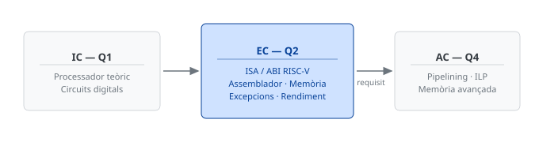
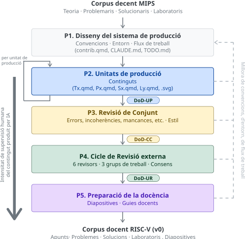
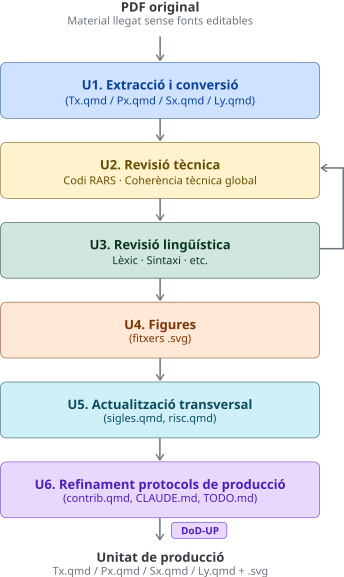
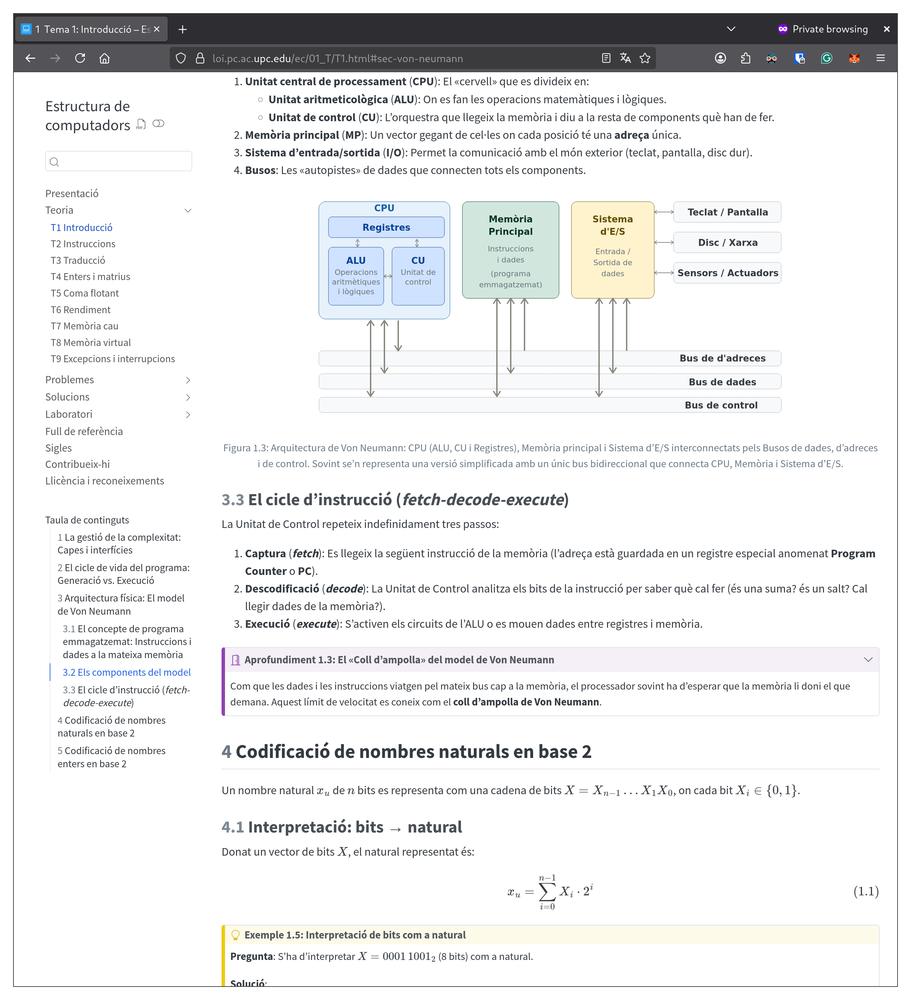
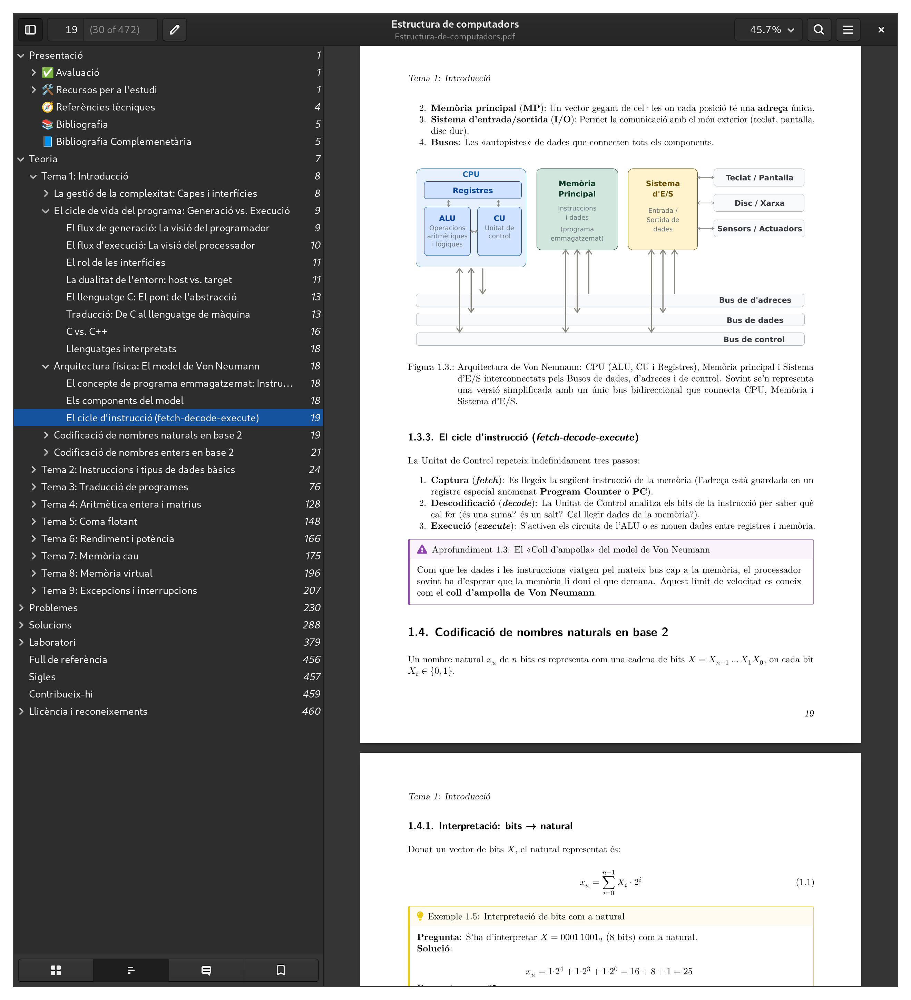
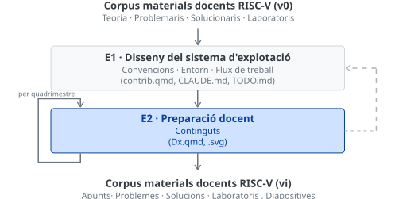

## L'assignatura i el concepte clau: la ISA {#sec-context-ec data-timing="55"}

:::: {.columns}
::: {.column width="55%"}
**Estructura de Computadors (EC)** ensenya com un computador executa instruccions. És la peça central de l'eix d'arquitectura del grau:

{width="100%"}
:::
::: {.column width="45%"}
La **ISA** (*Instruction Set Architecture*) és el contracte entre el **maquinari** i el **programari**: el repertori d'instruccions que la CPU entén.

L'**ABI** hi afegeix les convencions d'ús: registres, pas de paràmetres, crides.

. . .

> Canviar d'ISA és canviar el **llenguatge fonamental** que ensenyem.
:::
::::

::: {.notes}
(~0:55) Abans d'entrar en matèria, dos apunts perquè tothom segueixi el fil. Primer, l'assignatura: Estructura de Computadors ensenya com un computador executa instruccions per dins, i és la peça central de l'eix d'arquitectura del grau, entre Introducció als Computadors i Arquitectura de Computadors. Segon, i és el concepte clau de tota la xerrada: la ISA, l'*Instruction Set Architecture*, és el contracte entre el maquinari i el programari —el repertori d'instruccions que el processador entén i executa—. L'ABI hi afegeix, un pas per sobre, les convencions d'ús: quins registres es fan servir per a què, com es passen els paràmetres a les funcions. Amb això n'hi ha prou; quedeu-vos amb una idea: canviar d'ISA vol dir canviar el llenguatge més fonamental que ensenyem. — Pont: i el que ensenyem, avui, ha quedat enrere.
:::

## Per què migrar? {#sec-perque data-timing="65"}

- **MIPS** — la ISA de referència d'EC des dels orígens; avui, rellevància industrial perduda
- **RISC-V** — estàndard obert de facto, adoptat per la indústria i la Unió Europea
- Patterson i Hennessy han **reescrit** el seu llibre de referència al voltant de RISC-V

. . .

> Que els pioners d'una arquitectura l'abandonin per adoptar-ne una d'oberta és la millor prova del canvi de paradigma.

::: {.notes}
(~1:05) El que hem ensenyat fins ara, MIPS, ha perdut la seva rellevància industrial. En canvi, RISC-V s'ha consolidat com l'estàndard obert de facto, adoptat per la indústria i per la Unió Europea com a via cap a la sobirania tecnològica. Però la prova acadèmica més clara del canvi de paradigma és que Patterson i Hennessy, dels creadors de MIPS, han reescrit el seu llibre de referència sencer al voltant de RISC-V. Quan els pares d'una arquitectura la deixen per una d'oberta, el senyal és inequívoc. I la FIB no seria pionera aïllada: Berkeley i Cornell ja han migrat. Calia posar-s'hi. — Pont: però migrar no és només canviar de llenguatge.
:::

## Però no és només un canvi d'arquitectura {#sec-abast data-timing="70"}

::: {.incremental}
- Mirada curta: **canviar la ISA** (MIPS → RISC-V) i prou
- Oportunitat real — una **renovació integral**:
  - **Redissenyar** el contingut, no només traduir-lo
  - Obrir el **format**: de PDF tancat a Quarto Markdown
  - Construir un **sistema de qualitat** que no existia en cap forma
:::

::: {.notes}
(~1:15) Ara bé, hauria estat un error quedar-se en el port tècnic: canviar la sintaxi de MIPS per la de RISC-V i llestos. Aquesta reorientació —entendre-ho com una renovació integral i no com una traducció— la dec en bona part a una conversa primerenca amb en David López, que em va animar a focalitzar-me en el redisseny de continguts. Tres eixos: redissenyar el contingut aprofitant per reordenar temes densos o inconnexos; obrir el format, passant de PDF tancat a Quarto Markdown; i construir un sistema de qualitat documentat que als materials originals no existia. — Pont: aquests tres eixos són els meus tres objectius específics.
:::

## Objectius {#sec-objectius data-timing="35"}

::: {.incremental}
- **OE1** · Migració completa del corpus a RISC-V
- **OE2** · Transformació a format obert i accessible
- **OE3** · Establiment d'un sistema de qualitat documentat
:::

::: {.notes}
(~0:35) Aquesta renovació integral es concreta en tres objectius específics, que us aniré tancant al final. OE1: migrar tot el corpus —teoria, problemes i laboratoris— a RISC-V. OE2: transformar-lo a un format obert i accessible. I OE3: establir un sistema de qualitat documentat que faci el corpus auditable i replicable. — Pont: el repte, però, no era decidir què fer, sinó com fer-ho tot, i a temps.
:::

## L'obstacle: escala contra recursos {#sec-obstacle data-timing="45"}

- Un corpus **sencer**: teoria + problemes + solucionaris + laboratoris
- **Un sol professor**, amb temps fragmentat
- El pla inicial era modest: acabar **només la teoria** per al lliurament

. . .

> Com produir un corpus complet, **validat** i de qualitat a aquesta escala?

::: {.notes}
(~0:50) I aquí ve l'obstacle real. Estem parlant d'un corpus sencer: nou temes de teoria, els seus problemes, els solucionaris i sis sessions de laboratori. I un sol professor, amb el temps fragmentat que tots coneixem. De fet, el pla que vaig presentar al lliurament intermedi era deliberadament modest: acabar només la teoria. La pregunta que estructura tot el projecte és aquesta: com es produeix un corpus complet, validat i de qualitat, a aquesta escala i amb aquests recursos? — Pont: la resposta és una manera de treballar, no una eina màgica.
:::

## El mètode: el professor com a director tècnic {#sec-metode data-timing="105"}

:::: {.columns}
::: {.column width="52%"}
{width="88%"}
:::
::: {.column width="48%"}
- Gestió **àgil** (adaptada de Scrum) + IA com a accelerador
- Pivot decisiu **NotebookLM → [Claude]{.ia}**: manté el context complet del projecte en una sola sessió
- El docent passa d'**escriptor** a **director tècnic**
- Supervisió humana **creixent** per fase (P2 → P4)
:::
::::

::: {.notes}
(~1:50) La resposta té dues potes. La primera: gestió àgil, adaptant elements de Scrum a la creació de continguts —treballar per unitats temàtiques, de manera iterativa, no com un bloc monolític. La segona: la IA generativa com a accelerador. Vaig començar amb NotebookLM, útil per validar la idea, però el punt d'inflexió va ser passar a Claude: la capacitat de mantenir el context complet del projecte —convencions, decisions prèvies, estructura— en una sola sessió va eliminar la fragmentació i va disparar la velocitat i la qualitat. Ara bé —i això és el que vull remarcar— el meu rol no es va reduir, es va transformar: vaig passar d'escriptor a director tècnic. Fixeu-vos en la fletxa de l'esquerra de l'esquema: la supervisió humana creix a mesura que avancem de fase, mínima a la producció bruta i màxima a la revisió col·legiada. — Pont: i què és, exactament, el que fa que aquesta producció sigui fiable i no un abocador d'al·lucinacions?
:::

## Què fa fiable la producció amb IA {#sec-fiabilitat data-timing="105"}

:::: {.columns}
::: {.column width="40%"}
{width="82%"}
:::
::: {.column width="60%"}
Tres garanties de qualitat:

- **DoDs** (*Definition of Done*, de Scrum): criteris binaris verificables a cada fase
- **Validació a RARS**: **cada línia** d'assemblador, executada al simulador
- **Terminologia documentada**: coherència a través de 36 fitxers

. . .

> La IA accelera la producció; la **intel·ligència pedagògica** continua sent humana.
:::
::::

::: {.notes}
(~1:50) Aquesta és la diapositiva central de la defensa. Les eines d'IA produeixen codi RISC-V sintàcticament plausible però no necessàriament correcte: errors subtils d'ABI, d'ordre d'operands, de pseudoinstruccions. Passen desapercebuts en una lectura ràpida i fallen en execució. Per això el sistema descansa en tres garanties. Primera: les Definitions of Done, criteris binaris verificables —adaptats de Scrum— que cada unitat ha de complir abans de tancar-se; en tinc tres, per producció, per revisió de conjunt i per revisió externa. Segona, i innegociable: he validat cada línia d'assemblador del corpus al simulador RARS, executant-la. Aquest pas no és automatitzable, i no ha de ser-ho: és precisament on l'expertesa del professor és imprescindible. Tercera: un sistema de convencions terminològiques documentat que manté la coherència en 36 fitxers. La conclusió, que és també la resposta a la pregunta ètica de fons: la IA accelera; el judici pedagògic és, i ha de continuar sent, humà. — Pont: amb aquest mètode, els resultats van superar el pla.
:::

## Resultats: vam superar el pla {#sec-resultats data-timing="70"}

::: {.assolit}
**100%** del corpus completat  ·  **36** fitxers `.qmd`  ·  **+100** figures SVG (light + dark)
:::

 

| Previst al lliurament intermedi | Assolit al lliurament final |
|:---|:---|
| Només la **teoria** | **Tot** el corpus: teoria, problemes, solucionaris i laboratoris + 23 exercicis nous |

 

- La diferència és directament atribuïble a l'adopció de [Claude]{.ia} com a eina principal
- Revisió Externa **ja en curs**: protocol, calendari i grups de treball establerts

::: {.notes}
(~1:20) I els resultats van superar la previsió amb escreix. On el pla deia "només teoria", vam assolir el corpus sencer: teoria, problemes, solucionaris i laboratoris, més 23 exercicis nous sobre continguts que a MIPS ni existien —com les excepcions i interrupcions, ara avaluables gràcies als registres CSR de RISC-V. En números: 100% del corpus, 36 fitxers, més de cent figures SVG, cadascuna en versió clara i fosca. Aquesta diferència entre el previst i l'assolit és directament atribuïble a l'adopció de Claude. I no acaba aquí: la Revisió Externa ja està en marxa, amb sis revisors, protocol, calendari i grups de treball establerts. — Pont: però he insistit que no és una traducció. Deixeu-me ensenyar-vos el redisseny.
:::

## No és un port: és un redisseny {#sec-redisseny data-timing="85"}

| RISC-V (nou) | MIPS (original) | Naturalesa del canvi |
|:---|:---|:---|
| **T1** + **T6** | T1 (introducció **i** rendiment) | **Dividit**: se separen dos blocs inconnexos |
| **T4** · Aritmètica entera | T5 (barrejada amb coma flotant) | **Avançada** a T4; redueix la càrrega cognitiva |
| **T5** · Només coma flotant | T5 (aritmètica **+** CF) | Frontera conceptual **clara** |

 

- Els temes de la ISA (T2–T5, T9) **reescrits íntegrament**; jerarquia de memòria (T7–T8) **ampliada** (GPU, IA, taules multinivell)
- Decisions **documentades** i justificades pedagògicament, no arbitràries

::: {.notes}
(~1:30) El redisseny és la petjada intel·lectual del projecte, i on la migració deixa de ser tècnica per ser pedagògica. Tres exemples. El T1 original barrejava la introducció conceptual amb rendiment i potència, dos blocs sense connexió; els he separat en T1 i T6, i T6 queda com a avantsala natural de la memòria cau. L'aritmètica entera, que a MIPS vivia dins del T5 barrejada amb la coma flotant, l'he avançat al T4; això redueix la càrrega cognitiva i deixa el T5 dedicat exclusivament a coma flotant, amb una frontera conceptual neta. Els temes on MIPS i RISC-V divergeixen més —tota la ISA— estan reescrits de zero; els de jerarquia de memòria, ampliats amb context actual: GPU, IA, taules de pàgines multinivell. Cada decisió està documentada i justificada a la memòria, amb taules de correspondència completes. No és reordenar per reordenar. — Pont: i tot això, en un format radicalment més obert.
:::

## Un sol origen, dos formats {#sec-formats data-timing="55"}

:::: {.columns}
::: {.column width="70%"}
{width="100%"}
:::
::: {.column width="30%"}
{width="100%"}

::: {.small}
El **mateix** fragment, des d'una **única font** Quarto — sense cap edició manual · HTML accessible **WCAG 2.1**
:::
:::
::::

::: {.notes}
(~1:00) Aquest és el fruit de l'OE2. La imatge gran és el format HTML, el veritablement nou: navegació lateral, cercador integrat, mode fosc i clar, disseny responsive, accessibilitat WCAG 2.1 i referències creuades que enllacen teoria, problemes, solucionaris i laboratoris —un estudiant que llegeix un laboratori salta directament a la teoria que aplica, cosa impossible al PDF original—. A la dreta, el mateix contingut renderitzat en PDF d'alta qualitat amb LuaLaTeX. El punt clau, i el que tanca l'OE2: tots dos formats surten de la mateixa font Quarto, sense cap retoc manual. — Pont: i res d'això és específic de l'arquitectura de computadors.
:::

## Un model exportable a STEAM {#sec-model data-timing="70"}

:::: {.columns}
::: {.column width="46%"}
{width="100%"}
:::
::: {.column width="54%"}
Ingredients **reutilitzables** per a qualsevol assignatura STEAM:

- Format de marcatge pla + control de versions
- IA supervisada amb rol humà **explícitament definit**
- Convencions documentades

Llegat concret:

- **Recull terminològic RISC-V en català** normatiu — reutilitzable
- Repositori **públic** a GitLab
- Una **alfabetització en gestió de projectes amb IA** per a l'ICE
:::
::::

::: {.notes}
(~1:20) La contribució de fons va més enllà d'EC. L'arquitectura metodològica —format de marcatge pla, control de versions, IA supervisada amb un rol humà ben definit, i convencions documentades— no és específica ni de l'arquitectura de computadors ni de la informàtica. Qualsevol assignatura STEAM amb materials tècnics a actualitzar pot aplicar-la, i totes les eines són obertes o gratuïtes. Deixo llegat concret: el primer recull terminològic sistemàtic de RISC-V en català normatiu, reutilitzable per altres assignatures de l'àmbit; un repositori públic; i, sobretot, un missatge per a l'ICE: la formació del professorat en IA ha d'anar més enllà d'adoptar eines soltes; ha de ser una alfabetització en la gestió de projectes assistits per IA. L'esquema mostra com el projecte continua: cada quadrimestre d'ús a l'aula retroalimenta i millora el corpus. — Pont: i amb això arribo a la idea que us vull deixar.
:::

## En síntesi {#sec-sintesi data-timing="30"}

> La IA generativa **multiplica** la producció de materials docents.
> Només la **supervisió experta** la converteix en producció de **qualitat**.

 

::: {.lead}
El docent no queda substituït: queda **promogut a director**.
:::

 

- Corpus complet, validat i redissenyat — **a punt per al Q1 2026-27**
- OE1, OE2 i OE3 **assolits**

::: {.small}
Web: loi.pc.ac.upc.edu/ec · Repositori: gitlab.upc.edu/ec
:::

::: {.notes}
(~0:30) Tanco amb la idea única. La IA generativa multiplica la capacitat de producció de materials docents; això és real i el projecte ho demostra. Però només la supervisió experta la converteix en producció de qualitat. La conseqüència per a la nostra professió no és que la IA substitueixi el docent: és que el promou a director. El resultat tangible és el material d'un curs sencer, complet, validat i redissenyat, a punt per estrenar-se el primer quadrimestre del 2026-27, amb els tres objectius específics assolits. Moltes gràcies; quedo a la vostra disposició per a les preguntes.
:::
